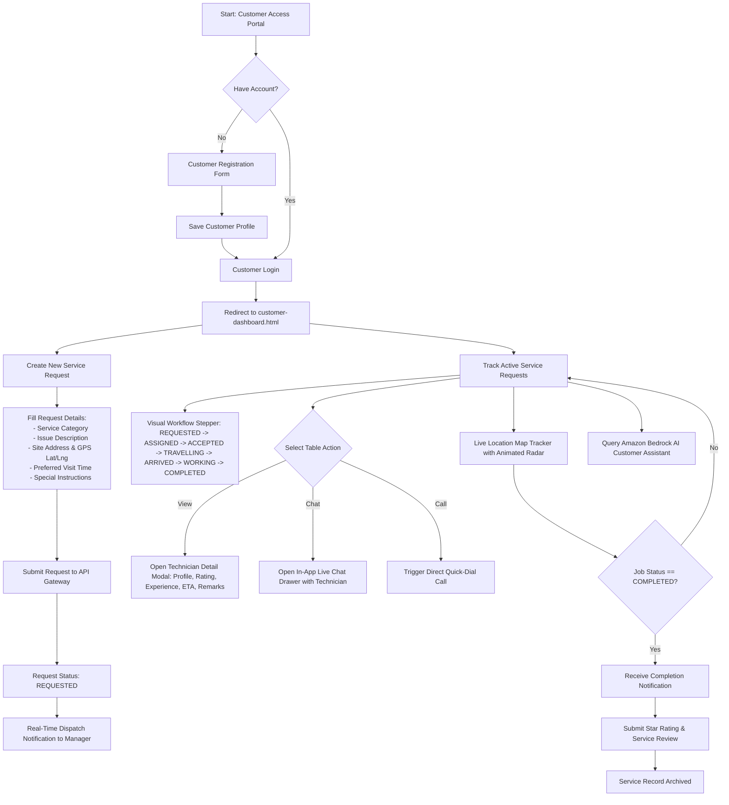
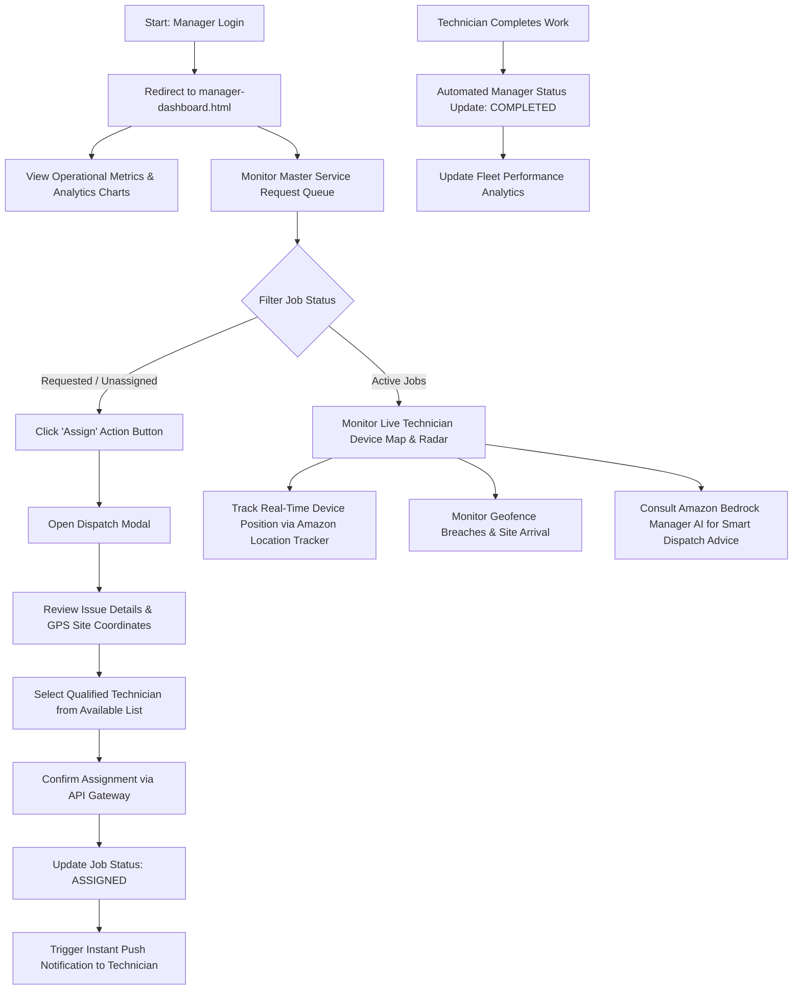
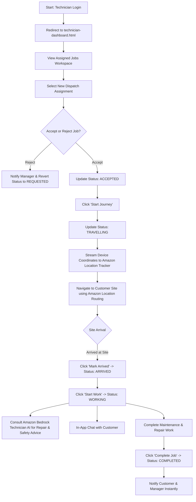
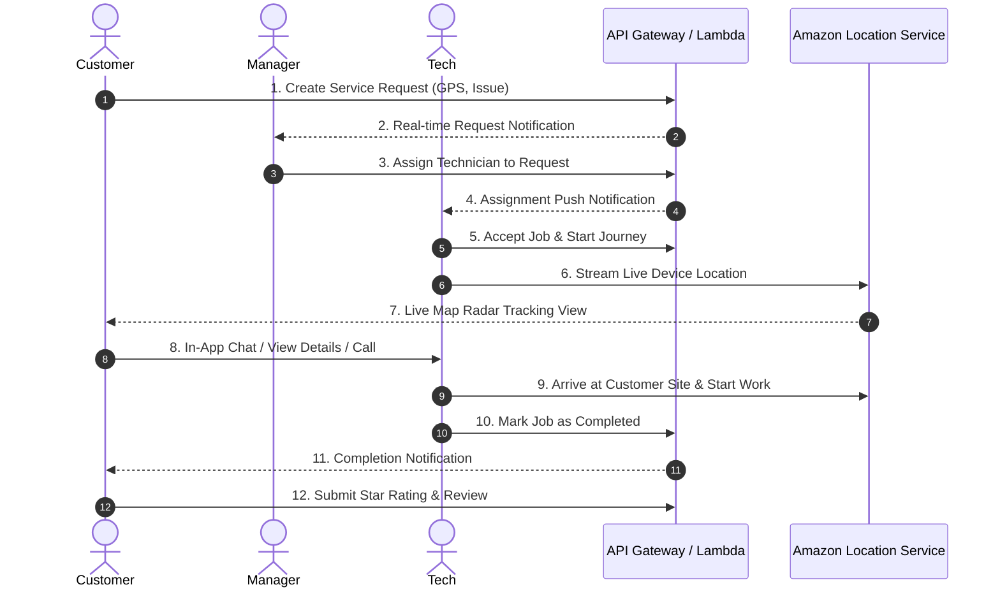

# Amazon Location Service - Field Service Management System Flowcharts

This document details the operational flowcharts for all three role-based portals: **Customer**, **Manager/Admin**, and **Technician**.

---

## 1. 👤 Customer Workflow Flowchart

---

## 2. 👨‍💼 Manager / Admin Workflow Flowchart

---

## 3. 🛠️ Technician Workflow Flowchart

---

## 4. 🔄 End-to-End Integrated Job Lifecycle

